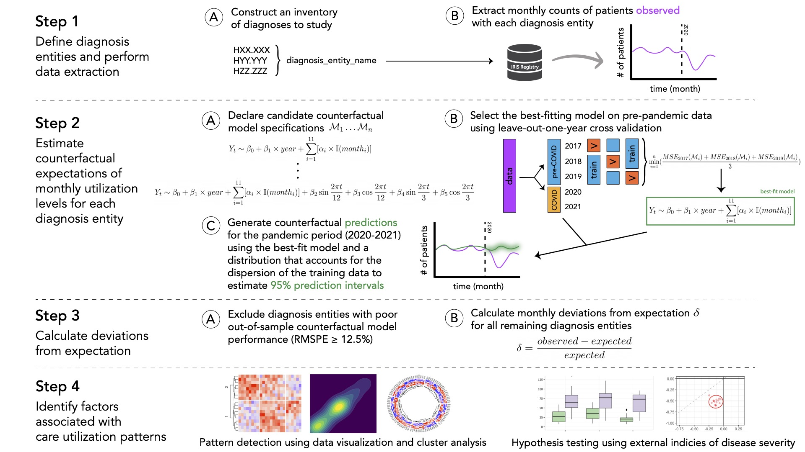

# Shifts in Care Utilization Patterns During the COVID-19 Pandemic: A High-Dimensional Study of Presentations for Ophthalmic Conditions in the United States
_Charles Li, Flora Lum, Evan M. Chen, Philip A. Collender, Jennifer R. Head, Rahul N. Khurana, Emmett T. Cunningham Jr., Ramana S. Moorthy, David W. Parke II, Stephen D. McLeod_

*Last updated:* **August 6, 2023** by Charles Li (cli@aao.org), including data up to **December 31, 2021**

## About

This repository hosts the code, outputs, and supplementary information for a study focused on understanding the disruptions to ophthalmic care in the United States for the first two years of the COVID-19 pandemic. Using data from the [American Academy of Ophthalmology IRIS:registered: Registry (Intelligent Research in Sight)](https://www.aao.org/iris-registry), this research characterized patterns of eye care utilization across 261 different ocular conditions from January 2020 to December 2021 by leveraging a common analytical framework to explore factors that may explain the differential underutilization of care. 

In the acute phase of the pandemic, redistributions of healthcare resources were required to minimize mortality and limit the spread of COVID-19. However, the patterns of, and reasons explaining, sustained utilization reductions in the post-acute phase are not entirely understood. Existing research by health economists have estimated the "elasticity" (i.e., responsiveness) of demand of healthcare services in response to changes in another variable (e.g., cost, income); similarly, we explored how utilization levels for a wide range of ocular diagnoses exhibited varying degrees of sensitivity to possible pandemic-related restrictions to the seeking or delivery of care (e.g., resource constraints, behavioral modifications). We specifically examined whether features of ocular diagnoses themselves&mdash;namely, disease severity&mdash;could explain shifts in care utilization patterns that were observed during the pandemic.

## Data Processing and Analytic Steps

This project consists of the following main stages:

### Step 1A. Construct an inventory of ophthalmic diagnoses to study

1. We first specified an inventory of conditions ("diagnosis entities") to include for analysis using the spreadsheet file `codebooks/source materials/CCSR ICD10 5.4.20_modified.xlsx`, adapted from [v2020.2](https://www.hcup-us.ahrq.gov/toolssoftware/ccsr/v2020_2.zip) of the U.S. Agency for Healthcare Research and Quality [Clinicial Classifications Software Refined (CCSR) database](https://www.hcup-us.ahrq.gov/toolssoftware/ccsr/ccs_refined.jsp#overdiagnoses). The CCSR aggregates tens of thousands of International Classification of Diseases, Tenth Revision, Clinical Modification (ICD-10-CM) diagnosis codes into [clinically meaningful groupings](https://www.hcup-us.ahrq.gov/toolssoftware/ccsr/DXCCSR-User-Guide-v2023-1.pdf), which are called "diagnosis entities" in this study. We mainly considered codes from the "EYE" chapter of the CCSR, which encompasses ICD-10-CM codes related to diseases of the eye and adnexa, for this study. 

    `CCSR ICD10 5.4.20_modified.xlsx` contains two tabs:
    
    * The first tab is a spreadsheet that maps each ICD-10-CM diagnosis code (`ICD-10 Code`) to a diagnosis entity (`DiagnosisEntity`). Each distinct ICD-10-CM code is listed once (on a single row), with the ICD-10-CM description of the diagnosis code (`Diagnosis`), the diagnosis entity that the ICD-10-CM code belongs to (`DiagnosisEntity`), and the broader diagnosis category that the diagnosis entity belongs to (`CCSR Category`), in abbreviation form (EYE0XX), listed across the columns of the spreadsheet. Unlike the original CCSR mapping, which allowed for some ICD-10-CM codes to be cross-classified into more than one category, we adopted a mutually exclusive categorization scheme by assigning each diagnosis entity to one of 13 diagnosis categories (EYE001 - EYE013). Furthermore, an ICD-10-CM diagnosis code with incomplete time series (TS) data of monthly counts of patients observed with that condition and/or very low monthly case counts was excluded from consideration in this study if it was not feasible to assign the code into an existing or new (standalone) diagnosis entity in a clinically meaningful way. For ICD-10-CM codes that are not assigned to any diagnosis entity, `CODE EXCLUDED` was written in the `DiagnosisEntity` column. **Text S4** of the [Supplementary Information]() contains further details on the assignment of ICD-10-CM codes to diagnosis entities and other adaptations made from the original groupings provided by the CCSR database.

    * The second tab includes a list the full names of the diagnosis categories and their abbreviations (EYE0XX).

    For ease of import into R, both sheets of the Excel file were separately converted into CSV format:
    > **Outputs**: \
     `codebooks/source materials/CCSR ICD10 dx_entities 5.4.20_modified.csv`\
     `codebooks/source materials/CCSR ICD10 categories 5.4.20_modified.csv`

2. Next, we ran the R script `codebooks/source materials/ccsr_codebook_qc_wrangling.Rmd` to produce a clean mapping of ICD-10-CM codes and diagnosis entities, which can be subsequently imported into a relational database as a lookup table to allow monthly case numbers to be queried for each diagnosis entity. Data pre-processing steps and quality control checks were applied to remove ICD-10-CM codes designated for exclusion, format ICD-10-CM codes to ensure compatability with database queries, and verify that each diagnosis entity is assigned to exactly one diagnosis category. 

    > **Inputs**:\
      `codebooks/source materials/CCSR ICD10 dx_entities 5.4.20_modified.csv`\
      `codebooks/source materials/CCSR ICD10 categories 5.4.20_modified.csv`\
      **Output**:\
      `codebooks/ccsr_codebook_for_sql.csv`

### Step 1B. Extract monthly counts of patients observed with each diagnosis

Monthly numbers of patients documented with each diagnosis entity were queried from the IRIS Registry (Amazon Redshift version 1.0.38698, PostgreSQL 8.0.2). The SQL script `data-extraction/covid19_alldx_pull.sql`, as well as the **Methods** section of the [Manuscript](), details the steps undertaken for data extraction, including the criteria we applied to identify diagnosis records and patients eligible for inclusion in this analysis. The final output of this script is a single table that contains the numbers of patients documented with each diagnosis entity for each month of the study period (January 2017 to Decemeber 2021). 

> **Input**:\
 `codebooks/ccsr_codebook_for_sql.csv`\
  **Output**:\
 `data-extraction/covid_elasticity_all_dx_2017_2021_complete_20220519.csv`

> **Note**: Direct access to the IRIS Registry database is needed to run the `covid19_alldx_pull.sql` script. At this time, the IRIS Registry is not a publicly available dataset, but eligible investigators may apply for [research opportunities](https://www.aao.org/iris-registry/data-analysis/requirements) to work with IRIS Registry data.

### Steps 2-4. Statistical modeling & data analysis

1. After exporting a single table containing monthly time series data of case counts for each diagnosis entity, some data pre-processing and wrangling steps were undertaken via the R script `data-extraction/covid_elasticity_dataset_prep.Rmd` to generate a single, clean dataset for further analysis. These steps include applying appropriate formatting to year-month date information, applying appropriate string formatting to ensure consistent representations of diagnosis entity names, and generating harmonic terms with 3, 6, and 12-month periodicities.
    
    > **Input**:\
    `data-extraction/covid_elasticity_all_dx_2017_2021_complete_20220519.csv`\
    **Output**:\
    `data-extraction/dx_proportions_and_cnts.csv`

2. Finally, all steps undertaken for statistical modeling and data analysis (as described in Steps 2-4 in the summary graphic above) were implemented via the R script `modeling-analysis/covid-elasticity-static-figures.Rmd`.

    > **Inputs**:
     * `data-extraction/dx_proportions_and_cnts.csv`
     * `codebooks/ccsr_codebook_for_sql.csv`
     * `codebooks/source materials/CCSR ICD10 categories 5.4.20_modified.csv`
     * `codebooks/base_score_modified.csv` mapping of diagnosis entities in this study to the ocular emergencies surveyed in the [BAsic SEverity Score for Common OculaR Emergencies (BaSe SCOrE) study](https://pubmed.ncbi.nlm.nih.gov/26294965/) by Bourges et al. (**Table S3** of the [Supplementary Information]())
     * `codebooks/VT_vs_NVT_Big4_crosswalk.csv` classification of diagnosis entities related to diabetic retinopathy, age-related macular degeneration, and glaucoma as vision-threatening vs. not vision-threatening (**Table S4** of the [Supplementary Information]())
      
    > **Outputs** (supplementary data):
     * `modeling-analysis/dx-entity-models-summstats.csv` summary statistics and counterfactual model performance metrics for all 336 diagnosis entities considered for inclusion in the analysis (**Table S2** of the [Supplementary Information]())
     * `modeling-analysis/dx-entity-codebook-export` folder containing Word document tables (one for each diagnosis category) of the mapping between ICD-10-CM codes and diagnosis entities (converted to PDF format for **Table S1** of the [Supplementary Information]())
     * `modeling-analysis/dx-entity-deviations.csv` estimated deviations from expected utilization levels for each month of the pandemic study period, for the 261 diagnosis entities included in the analysis (visualized in **Figure S7** of the [Supplementary Information]())
     * `modeling-analysis/dx-entity-deviation-bounds.csv` 95% confidence intervals for estimated deviations from expected utilization levels for each month of the pandemic study period, for the 261 diagnosis entities included in the analysis (**Table S9** of the [Supplementary Information]())
     * `modeling-analysis/dx-entity-deviation-pvalues.csv` Unadjusted p-values for estimated deviations from expected utilization levels for each month of the pandemic study period, for the 261 diagnosis entities included in the analysis (**Table S7** of the [Supplementary Information]())
     * `modeling-analysis/dx-entity-deviation-pvalues-adj.csv` Adjusted p-values (via FDR) for estimated deviations from expected utilization levels for each month of the pandemic study period, for the 261 diagnosis entities included in the analysis (**Table S8** of the [Supplementary Information]()) 
     * `modeling-analysis/dx-entity-quarterly-devs-and-recovery.csv` summary statistics, 95% confidence intervals, p-values (unadjusted and adjusted) for estimated deviations from expected utilization levels for each quarter of the pandemic study period, as well as information on time-to-recovery and recovery status, for the 261 diagnosis entities included in the analysis
       
    > **Outputs** (main figures):
     * `main-figures/figure-2.pdf` (**Figure 2** of the [Manuscript]())
     * `main-figures/figure-3.pdf` (**Figure 3** of the [Manuscript]())
     * `main-figures/figure-4.pdf` (**Figure 4** of the [Manuscript]())
     * `main-figures/figure-5.pdf` (**Figure 5** of the [Manuscript]())
     * `main-figures/figure-6.pdf` (**Figure 6** of the [Manuscript]())
       
    > **Outputs** (supplemental figures/tables):
     * `suppl-figs-tables/figure-s1.pdf` (**Figure S1** of the [Supplementary Information]())
     * `suppl-figs-tables/figure-s2.pdf` (**Figure S2** of the [Supplementary Information]())
     * `suppl-figs-tables/figure-s3.pdf` (**Figure S3** of the [Supplementary Information]())
     * `suppl-figs-tables/figure-s4.pdf` (**Figure S4** of the [Supplementary Information]())
     * `suppl-figs-tables/figure-s5.pdf` (**Figure S5** of the [Supplementary Information]())
     * `suppl-figs-tables/figure-s6.pdf` (**Figure S6** of the [Supplementary Information]())
     * `suppl-figs-tables/figure-s7.pdf` (**Figure S7** of the [Supplementary Information]())
     * `suppl-figs-tables/table-s5.pdf` (**Table S5** of the [Supplementary Information]())
     * `suppl-figs-tables/table-s6.pdf` (**Table S6** of the [Supplementary Information]())
